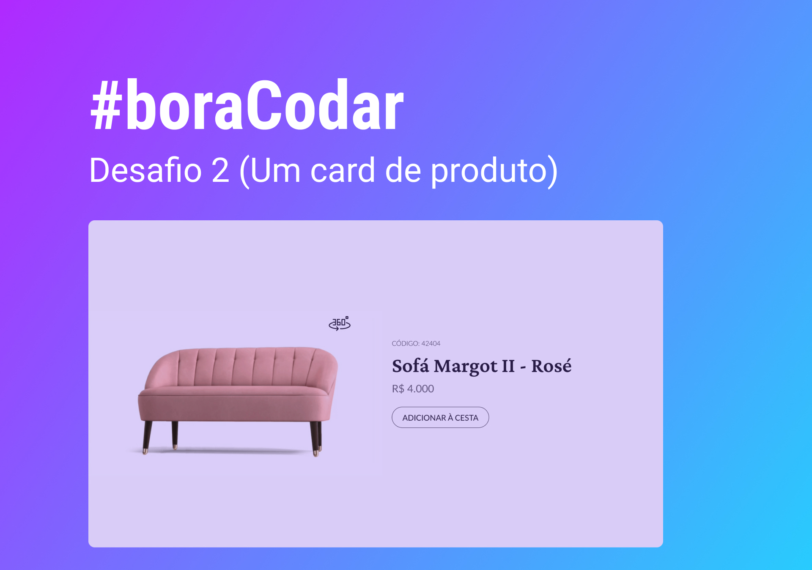
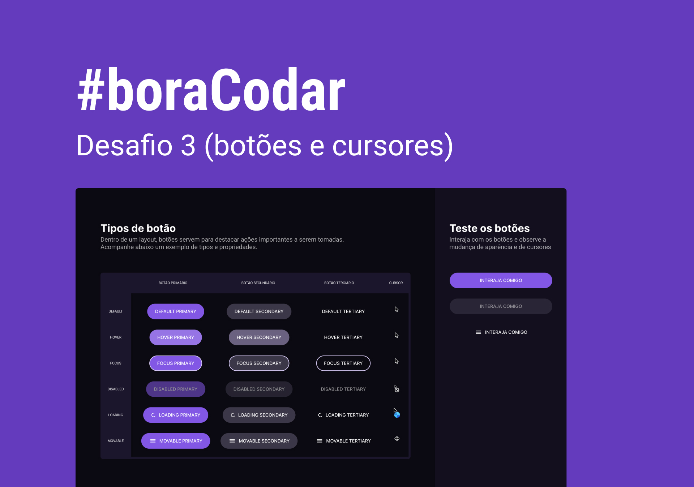

# #boraCodar

    Projetos #boraCodar da Rocketseat   
  <table>
    <thead>
      <tr>
        <th align="center">
           
          

            <small>#</small>
          

        </th>
        <th align="center">
           
          
 
            <small>NAME</small>
          

        </th>
        <th align="left">
          
          
 
            <small>PREVIEW</small>
          

        </th>
        <th align="center">
          
          
 
            <small>FIGMA</small>
          

        </th>
      </tr>
    </thead>
    <tbody>
      <tr>
        <td>01</td>
        <td><a href="01">Music Player</a></td>
        <td>
          <a href="https://boracodar01.netlify.app/" target="_blank">
            https://boracodar01.netlify.app/
          </a>
        </td>
        <td align="center">
        </td>
      </tr>
      <tr>
        <td>02</td>
        <td><a href="02">Product Card</a></td>
        <td>
          <a href="https://boracodar02.netlify.app/" target="_blank">
            https://boracodar02.netlify.app/
          </a>
        </td>
        <td align="center">
        </td>
      </tr>
      <tr>
        <td>03</td>
        <td><a href="03">Botões e Cursores</a></td>
        <td>
          <a href="https://botoesecursores.netlify.app/" target="_blank">
            https://botoesecursores.netlify.app/
          </a>
        </td>
        <td align="center">
        </td>
      </tr>
    </tbody>
</table>
